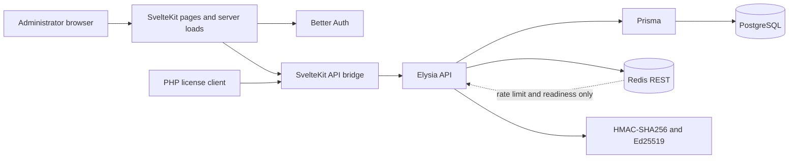
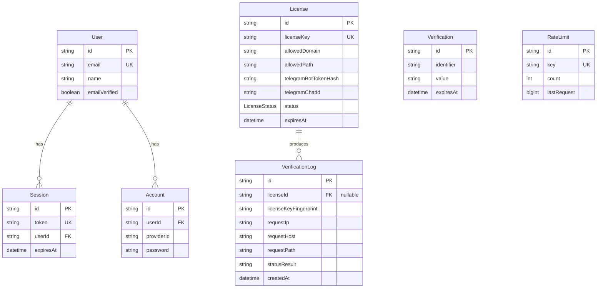

# LEPS

[English](README.md)

[](https://bun.sh/)
[](https://svelte.dev/)
[](https://nodejs.org/)
[](LICENSE)

LEPS adalah licensing engine self-hosted untuk script PHP proprietary. LEPS menggabungkan halaman produk publik, dashboard untuk satu administrator, API verifikasi server-to-server, riwayat audit, dan alur PHP client bertanda tangan dalam satu aplikasi SvelteKit.

## Ringkasan

LEPS memungkinkan vendor script mengikat lisensi ke:

- license key yang dibuat otomatis;
- hostname dan path instalasi yang diizinkan;
- token bot Telegram yang hanya disimpan sebagai keyed hash;
- chat ID Telegram;
- status eksplisit `ACTIVE` atau `SUSPENDED`; dan
- waktu kedaluwarsa yang selalu diperiksa saat request diproses.

PostgreSQL menjadi sumber kebenaran untuk setiap keputusan otorisasi. Redis REST digunakan di production untuk rate limiting publik dan readiness check—bukan untuk cache record lisensi. Response verifikasi yang valid ditandatangani dengan Ed25519 agar integritasnya dapat diverifikasi secara lokal oleh PHP client.

Kebutuhan produk, kontrak endpoint, keputusan teknis, dan aturan antarmuka dikelola di:

- [Product requirements](docs/PRD.md)
- [Functional specification](docs/SPEC.md)
- [Technical design](docs/TECHNICAL_DESIGN.md)
- [UI/UX specification](docs/UI_UX.md)

## Sorotan rewrite

- Satu aplikasi SvelteKit 2 + Svelte 5 untuk halaman, server load, route guard, dan deployment.
- Elysia dipasang di bawah `/api` melalui catch-all route SvelteKit.
- Otorisasi Prisma/PostgreSQL tanpa cache record lisensi yang dapat menjadi stale.
- Better Auth dengan signup publik yang dinonaktifkan permanen dan satu administrator terkonfigurasi.
- Binding Telegram HMAC-SHA256 dan response otorisasi bertanda tangan Ed25519.
- Antarmuka Soft Brutal yang responsif untuk halaman publik, login, overview, lisensi, dan audit.
- PHP client tanpa framework dengan local cache yang dikunci dan lazy revalidation.
- Workflow development native Windows dan target production Vercel Node.js.

## Fitur

### Publik dan autentikasi

- Halaman cerita produk publik dengan metadata yang dirender server.
- Login email/password melalui Better Auth.
- Guard dashboard di sisi server.
- Tanpa endpoint registrasi publik atau alur onboarding multi-user.

### Administrasi lisensi

- Membuat license key secara otomatis.
- Memfilter, mencari, dan membuat paginasi lisensi.
- Mengubah hostname, path, binding Telegram, status, dan waktu kedaluwarsa.
- Mengaktifkan, menangguhkan, memperpanjang, dan menghapus lisensi.
- Mengganti token bot Telegram tanpa menampilkan kembali hash yang tersimpan ke browser.
- Status efektif `EXPIRED` dihitung dari `expiresAt`, bukan disimpan sebagai status yang dapat diubah.

### Verifikasi dan audit

- Validasi boundary JSON yang ketat sebelum akses Redis atau database.
- Abuse limiting publik fixed-window sebesar 60 request verifikasi per menit untuk setiap IP sumber.
- Lookup PostgreSQL yang authoritative pada setiap request verifikasi.
- Evaluasi domain, path, expiry, state, bot token, dan chat ID.
- Tanda tangan Ed25519 atas byte payload otorisasi yang persis sama.
- Kode error deterministik dan request ID.
- Record audit untuk setiap percobaan verifikasi yang diterima, termasuk key yang tidak dikenal.
- Response dan log yang aman dari kebocoran secret.

### PHP client

- Menggunakan API native PHP, cURL, Sodium, JSON, dan file lock; tanpa dependency Composer.
- Pemeriksaan signed payload, binding, dan expiry sebelum pengiriman Telegram.
- Lazy API revalidation setiap 17.280 detik (4 jam 48 menit) selama lisensi aktif.
- Persistent locked cache agar request PHP concurrent memakai satu keputusan otorisasi bersama.
- Fail-closed ketika revalidation terjadwal tidak dapat diselesaikan.

## Non-goals

LEPS sengaja tidak menyediakan:

- organisasi, tim, RBAC, atau beberapa role administrator;
- billing, subscription, payment, atau portal lisensi pelanggan;
- signup publik atau infrastruktur email untuk reset password;
- dashboard realtime, WebSocket, atau event streaming;
- otorisasi offline-first;
- cache record lisensi di Redis; atau
- migrasi/seed production otomatis saat proses build Vercel.

## Arsitektur



| Komponen       | Tanggung jawab                                                                             |
| -------------- | ------------------------------------------------------------------------------------------ |
| SvelteKit      | Halaman publik, login, dashboard, server load, route guard, dan bridge `/api`.             |
| Elysia         | Health, auth, verifikasi publik, dan API administrator terautentikasi.                     |
| Better Auth    | Autentikasi credential, session, dan boundary administrator tunggal.                       |
| Prisma         | Akses typed ke record Better Auth, lisensi, dan verification log.                          |
| PostgreSQL     | User, session, lisensi, expiry, status, binding, dan riwayat audit yang authoritative.     |
| Redis REST     | Rate limiting publik dan readiness di production saja.                                     |
| PHP client     | Validasi signature/binding/expiry lokal, lazy revalidation, dan guard pengiriman Telegram. |
| Vercel adapter | Output serverless Node.js untuk deployment production.                                     |

## Tech stack

| Area                     | Teknologi                                                  |
| ------------------------ | ---------------------------------------------------------- |
| Application framework    | SvelteKit 2.69, Svelte 5.56                                |
| API framework            | Elysia 1.4                                                 |
| Runtime/package manager  | Bun 1.3.14 di lokal; Node.js 24 di Vercel                  |
| Autentikasi              | Better Auth 1.6 dengan Prisma adapter                      |
| Database                 | PostgreSQL + Prisma 6.19                                   |
| Rate limiting            | Vercel KV atau Upstash Redis REST                          |
| Kriptografi              | Node.js `crypto`: HMAC-SHA256 dan Ed25519                  |
| Integrasi PHP            | PHP 8.1+, cURL, Sodium, JSON, file locking                 |
| Styling                  | CSS komponen Svelte dengan primitive Soft Brutal responsif |
| Browser testing          | Playwright 1.61                                            |
| Type dan format checking | TypeScript 5.9, svelte-check 4.7, Prettier 3.9             |

## User flow

### Administrator

1. Buka `/login` dan autentikasi dengan email administrator yang dikonfigurasi.
2. Tinjau aktivitas lisensi dan verifikasi di `/dashboard`.
3. Buat lisensi dengan hostname, path, credential Telegram, dan expiry yang diizinkan.
4. Salin key yang dihasilkan satu kali untuk instalasi PHP.
5. Ubah, suspend, aktifkan, perpanjang, atau hapus lisensi sesuai kebutuhan.
6. Periksa riwayat audit terfilter tanpa mengekspos key penuh atau token bot.

### PHP client

1. Operasi PHP yang dilindungi meminta otorisasi kepada `LepsClient`.
2. Client memvalidasi signed cache lokal yang dikunci.
3. Ketika revalidation jatuh tempo, client memanggil `POST /api/v1/license/verify` satu kali.
4. LEPS memvalidasi input dan membatasi request berdasarkan IP sumber.
5. LEPS mengambil lisensi terkini dari PostgreSQL dan mengevaluasi semua binding.
6. LEPS mencatat hasil dan mengembalikan response `VALID` bertanda tangan atau error deterministik.
7. Client memverifikasi signature Ed25519, binding lokal, dan expiry yang tepat.
8. Hanya operasi yang terotorisasi yang boleh mengirim data langsung ke Telegram.

## ERD database



Menghapus lisensi akan mengatur `VerificationLog.licenseId` menjadi `null`; riwayat audit tetap tersedia. Lihat [schema Prisma lengkap](prisma/schema.prisma).

## Model keamanan

- Startup production memvalidasi konfigurasi database, Better Auth, HMAC, Ed25519, dan Redis.
- Identitas satu-satunya administrator berasal dari `ADMIN_EMAIL`; signup publik dinonaktifkan di kode.
- Password di-hash oleh Better Auth. Password seed lokal minimal 8 karakter; production minimal 12 karakter.
- Token bot Telegram ditransformasi dengan keyed HMAC-SHA256 yang dipisahkan berdasarkan purpose sebelum disimpan.
- License key di audit log hanya direpresentasikan sebagai keyed fingerprint.
- Private key Ed25519 tetap di server; deployment PHP hanya menerima public key.
- Verifikasi memvalidasi content type, ukuran body, exact fields, hostname, path, dan batas nilai Telegram sebelum rate limiting atau database lookup.
- Rate limiter Redis di production bersifat fail-closed ketika tidak tersedia.
- Kegagalan PostgreSQL menghasilkan response unavailable yang deterministik, bukan otorisasi stale.
- Verifikasi publik bersifat server-to-server dan secara default tidak mengaktifkan CORS browser.
- Security header, response no-store, pesan error aman, dan request ID terstruktur diterapkan di HTTP boundary.

Matriks kontrol lengkap didokumentasikan di [Technical Design §15](docs/TECHNICAL_DESIGN.md#15-security-controls) dan [SPEC §15](docs/SPEC.md#15-verification-matrix).

## Struktur project

```text
docs/                       Dokumen produk, fungsional, teknis, UI, dan eksekusi
prisma/
  migrations/               Migrasi PostgreSQL
  schema.prisma             Data model Better Auth, lisensi, dan audit
  seed.ts                   Seed single-admin yang idempotent
scripts/
  php-client/               PHP license client tanpa framework dan smoke CLI
  start-e2e.ps1             Launcher browser smoke lokal yang terisolasi
  verify-test-db.ps1        Verifier test database terisolasi yang fail-closed
src/
  lib/api/                  Aplikasi Elysia dan modul route
  lib/components/           Primitive UI Svelte reusable
  lib/server/               Auth, crypto, environment, Prisma, Redis, dan domain logic
  routes/                   Route publik, login, dashboard, dan API bridge
tests/                      Test API, database, domain, route, script, dan browser
```

## Prasyarat

- [Bun 1.3.14](https://bun.sh/) untuk instalasi, development, test, dan script lokal.
- [Node.js 24](https://nodejs.org/) untuk runtime production Vercel.
- PostgreSQL dengan izin membuat dan memigrasikan database development.
- Credential Redis REST untuk production (`KV_REST_API_*` atau `UPSTASH_REDIS_REST_*`).
- PHP 8.1+ dengan extension `curl` dan `sodium` saat menggunakan PHP client.
- Token bot dan chat ID Telegram untuk smoke test PHP end-to-end.

## Environment variables

Salin [.env.example](.env.example) menjadi `.env`; `.env` diabaikan oleh Git.

| Variable                      | Wajib                       | Tujuan                                                                      |
| ----------------------------- | --------------------------- | --------------------------------------------------------------------------- |
| `DATABASE_URL`                | Selalu                      | Connection string PostgreSQL. Gunakan endpoint pooled/serverless di Vercel. |
| `BETTER_AUTH_SECRET`          | Selalu                      | Secret signing/encryption Better Auth, minimal 32 karakter.                 |
| `BETTER_AUTH_URL`             | Selalu                      | Origin aplikasi canonical, misalnya `http://localhost:5173`.                |
| `LICENSE_BINDING_SECRET`      | Selalu                      | Secret HMAC terpisah, minimal 32 karakter.                                  |
| `LICENSE_SIGNING_PRIVATE_KEY` | Selalu                      | Key Ed25519 PKCS#8 DER dalam encoding base64.                               |
| `LICENSE_SIGNING_PUBLIC_KEY`  | Selalu                      | Key Ed25519 SPKI DER pasangan dalam encoding base64.                        |
| `ADMIN_EMAIL`                 | Selalu                      | Satu-satunya identitas yang boleh mengakses area administrator.             |
| `ADMIN_NAME`                  | Seed                        | Nama tampilan administrator yang di-seed.                                   |
| `ADMIN_PASSWORD`              | Seed                        | Password administrator awal; 8+ lokal, 12+ production.                      |
| `TEST_DATABASE_URL`           | Verifikasi test database    | Database PostgreSQL terisolasi dengan decoded name berakhiran `_test`.      |
| `KV_REST_API_URL`             | Production, satu pair Redis | URL Vercel KV/Redis REST.                                                   |
| `KV_REST_API_TOKEN`           | Production, satu pair Redis | Token Vercel KV/Redis REST pasangannya.                                     |
| `UPSTASH_REDIS_REST_URL`      | Production, pair alternatif | URL Upstash Redis REST langsung.                                            |
| `UPSTASH_REDIS_REST_TOKEN`    | Production, pair alternatif | Token Upstash Redis REST pasangannya.                                       |

Buat dua secret random yang independen:

```powershell
bun -e "const c=require('node:crypto'); console.log('BETTER_AUTH_SECRET='+c.randomBytes(32).toString('base64url')); console.log('LICENSE_BINDING_SECRET='+c.randomBytes(32).toString('base64url'))"
```

Buat satu pasangan Ed25519 yang matching:

```powershell
bun -e "const c=require('node:crypto');const k=c.generateKeyPairSync('ed25519');console.log('LICENSE_SIGNING_PRIVATE_KEY='+k.privateKey.export({type:'pkcs8',format:'der'}).toString('base64'));console.log('LICENSE_SIGNING_PUBLIC_KEY='+k.publicKey.export({type:'spki',format:'der'}).toString('base64'))"
```

Jangan pernah commit nilai yang dibuat atau mencetak secret production ke log.

## Setup lokal

1. Clone repository dan masuk ke direktori project:

   ```powershell
   git clone https://github.com/barkahistigozah/Licensing-Engine-for-PHP-Script.git
   Set-Location Licensing-Engine-for-PHP-Script
   ```

2. Instal dependency:

   ```powershell
   bun install
   ```

3. Salin template environment dan ganti setiap nilai wajib:

   ```powershell
   Copy-Item .env.example .env
   ```

4. Buat database PostgreSQL. Perintah persisnya bergantung pada instalasi PostgreSQL; template default mengharapkan `leps` dan `leps_test`:

   ```powershell
   createdb -U postgres leps
   createdb -U postgres leps_test
   ```

5. Terapkan migration development dan seed satu administrator dari `.env`:

   ```powershell
   bun run db:migrate
   bun run db:seed
   ```

6. Jalankan aplikasi:

   ```powershell
   bun run dev
   ```

7. Buka [http://localhost:5173](http://localhost:5173), lalu login menggunakan `ADMIN_EMAIL` dan `ADMIN_PASSWORD`.

`db:seed` bersifat idempotent dan hanya membuat administrator yang dikonfigurasi. Perintah ini tidak membuat lisensi contoh atau record audit.

## Perintah dan verifikasi

| Perintah                 | Tujuan                                                                    |
| ------------------------ | ------------------------------------------------------------------------- |
| `bun run dev`            | Menjalankan development server Vite/SvelteKit.                            |
| `bun run build`          | Membuat Prisma Client dan production build Vercel.                        |
| `bun run preview`        | Melihat preview dari production build yang berhasil.                      |
| `bun test`               | Menjalankan test API, database, domain, dan route.                        |
| `bun run check`          | Menyinkronkan SvelteKit dan menjalankan `svelte-check`.                   |
| `bun run format:check`   | Memverifikasi format Prettier untuk file project aktif.                   |
| `bun run db:generate`    | Membuat Prisma Client.                                                    |
| `bun run db:migrate`     | Membuat/menerapkan migration development.                                 |
| `bun run db:deploy`      | Menerapkan migration yang sudah di-commit di environment non-development. |
| `bun run db:reset`       | Me-reset database terkonfigurasi; destruktif.                             |
| `bun run db:seed`        | Melakukan upsert administrator terkonfigurasi.                            |
| `bun run db:verify:test` | Reset, migrate, seed dua kali, dan verifikasi DB `_test` terisolasi.      |

`bun run db:verify:test` menolak berjalan ketika `TEST_DATABASE_URL` tidak ada atau decoded database name-nya tidak berakhiran `_test`. Script ini tidak pernah fallback ke `DATABASE_URL`.

Verifikasi lokal yang direkomendasikan:

```powershell
bun test
bun run check
bun run format:check
git diff --check
```

## Smoke test PHP client

Pertama buat lisensi aktif yang cocok melalui dashboard. Kemudian berikan nilai process environment tanpa menuliskannya secara hardcode di PHP:

```powershell
$env:LEPS_API_URL="http://localhost:5173"
$env:LEPS_LICENSE_KEY="lic_replace_with_local_test_license"
$env:LEPS_INSTALL_DOMAIN="local.leps.test"
$env:LEPS_INSTALL_PATH="/php-client"
$env:LEPS_PUBLIC_KEY="replace_with_LICENSE_SIGNING_PUBLIC_KEY"
$env:TELEGRAM_BOT_TOKEN="replace_with_bot_token"
$env:TELEGRAM_CHAT_ID="replace_with_chat_id"
$env:LEPS_CACHE_FILE="$env:TEMP\leps-php-smoke.json"
php scripts/php-client/smoke.php
```

Output yang diharapkan:

```text
TELEGRAM_SENT=1
SECOND_AUTH_SOURCE=cache
```

Smoke CLI mengirim tepat satu pesan Telegram. `LepsClient` memverifikasi signature, license key, hostname, path, dan expiry pada setiap pengiriman yang dilindungi. Selama aktif, client melakukan lazy revalidation paling banyak satu kali setiap 17.280 detik: lima percobaan verifikasi terjadwal per 24 jam untuk setiap instalasi yang terus berjalan. Setiap percobaan network memajukan waktu percobaan berikutnya sehingga layanan LEPS yang gagal tidak memicu retry storm.

## Ringkasan API

Semua endpoint dipasang di bawah `/api`.

| Method                   | Endpoint                         | Akses          | Tujuan                                        |
| ------------------------ | -------------------------------- | -------------- | --------------------------------------------- |
| `GET`                    | `/api/health`                    | Publik         | Readiness database, konfigurasi, dan Redis.   |
| `POST`                   | `/api/v1/license/verify`         | Publik/limited | Memvalidasi dan menandatangani keputusan PHP. |
| `GET`                    | `/api/admin/stats`               | Administrator  | Count dashboard dan aktivitas terbaru.        |
| `GET`, `POST`            | `/api/admin/licenses`            | Administrator  | Menampilkan atau membuat lisensi.             |
| `GET`, `PATCH`, `DELETE` | `/api/admin/licenses/:id`        | Administrator  | Membaca, mengubah, atau menghapus lisensi.    |
| `POST`                   | `/api/admin/licenses/:id/extend` | Administrator  | Memperpanjang lisensi dari baseline efektif.  |
| `GET`                    | `/api/admin/audit-logs`          | Administrator  | Riwayat verifikasi terfilter dan terpaginasi. |
| Better Auth routes       | `/api/auth/*`                    | Auth contract  | Operasi login, logout, dan session.           |

Lihat [Functional Specification §2](docs/SPEC.md#2-route-matrix) dan [§11](docs/SPEC.md#11-public-verification) untuk schema dan response code yang persis.

## Deployment ke Vercel

1. Provision PostgreSQL dengan endpoint koneksi pooled/serverless.
2. Provision Vercel KV atau Upstash Redis REST.
3. Konfigurasi semua variable production dari `.env.example` di Vercel.
4. Atur `BETTER_AUTH_URL` ke origin HTTPS final.
5. Pertahankan runtime production pada Node.js 24; jangan aktifkan runtime Bun.
6. Jalankan `bun run db:deploy` dan `bun run db:seed` hanya terhadap database production yang telah dikonfirmasi.
7. Build dan smoke-test preview deployment sebelum promotion.

Production bersifat fail-closed ketika rate limiting Redis, PostgreSQL, atau secret wajib tidak tersedia. Jangan menjalankan migration atau seed otomatis di dalam public request path.

## Troubleshooting

### `Invalid origin` saat login lokal

Atur `BETTER_AUTH_URL="http://localhost:5173"`, restart dev server, lalu coba kembali dari origin yang sama persis.

### Prisma `EPERM` atau query engine terkunci di Windows

Hentikan proses Vite/Node yang sedang menahan DLL Prisma Windows, lalu jalankan:

```powershell
bun run db:generate
```

### Symlink `EPERM` Vercel adapter di Windows

Vercel adapter membuat symlink di `.vercel/output`. Gunakan Vercel/CI atau Windows dengan Developer Mode maupun privilege symlink setara. Ini adalah prasyarat environment, bukan alasan untuk mengganti runtime production.

### `ERR_CONFIGURATION_UNAVAILABLE`

Periksa URL database, secret/origin Better Auth, secret HMAC, dan pasangan Ed25519 yang matching. Production juga membutuhkan satu pair Redis REST yang lengkap.

### Verifier test database menolak URL

Atur `TEST_DATABASE_URL` ke database terpisah yang decoded database name-nya berakhiran `_test`, misalnya `leps_test`. Jangan melemahkan guard atau mengarahkannya ke data development/production.

## Status project

MVP rewrite telah diimplementasikan dan diverifikasi secara lokal pada jalur API, database, domain, route, PHP client, dan browser smoke. Release production tetap membutuhkan credential provider asli, konfirmasi migration, dan smoke preview Vercel yang berhasil di target environment.

Lihat [evidence eksekusi Implementation Plan](docs/IMPLEMENTATION_PLAN.md#batch-7-execution-evidence-2026-07-14-utc) untuk catatan pemeriksaan release-readiness.

## Kontribusi

1. Fork repository dan buat branch yang fokus.
2. Jaga agar perubahan selaras dengan PRD, SPEC, dan Technical Design.
3. Tambahkan regression test relevan yang paling kecil.
4. Jalankan `bun test`, `bun run check`, `bun run format:check`, dan `git diff --check`.
5. Buka pull request yang menjelaskan perubahan behavior, dampak keamanan, dan evidence verifikasi.

Hindari refactor yang tidak berhubungan, dependency baru tanpa kebutuhan yang terbukti, atau perubahan yang mengekspos license key, token hash, session, maupun private signing material.

## Pelaporan keamanan

Jangan membuka issue publik untuk dugaan kerentanan atau credential yang terekspos. Gunakan [alur pelaporan kerentanan privat](https://github.com/barkahistigozah/Licensing-Engine-for-PHP-Script/security/advisories/new) repository dan sertakan langkah reproduksi, path terdampak, dampak, serta usulan remediasi jika tersedia.

## Lisensi

LEPS dirilis dengan [Lisensi MIT](LICENSE).
