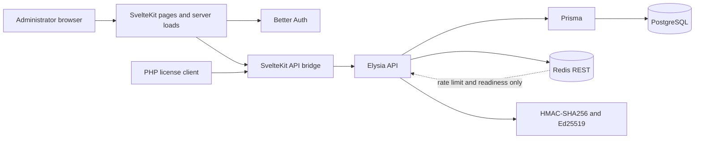
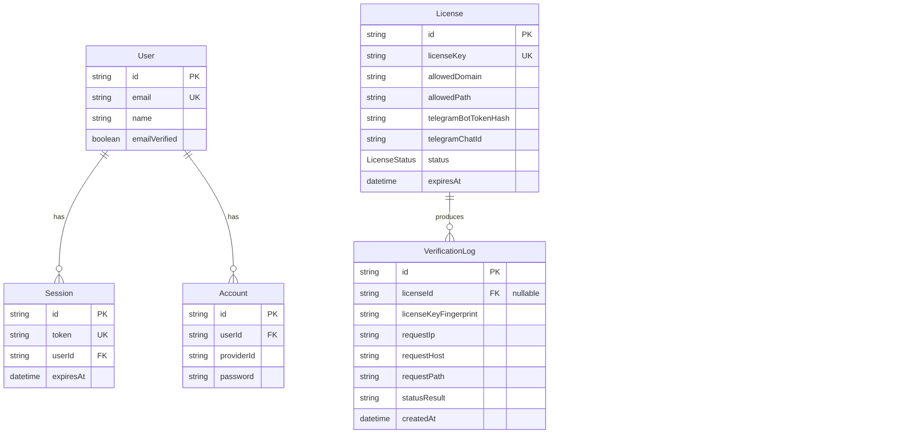

# LEPS

[Bahasa Indonesia](README.id.md)

[](https://bun.sh/)
[](https://svelte.dev/)
[](https://nodejs.org/)
[](LICENSE)

LEPS is a self-hosted licensing engine for proprietary PHP scripts. It combines a public product page, a single-administrator dashboard, a server-to-server verification API, audit history, and a signed PHP client flow in one SvelteKit application.

## Overview

LEPS lets a script vendor bind a license to:

- a generated license key;
- an approved hostname and installation path;
- a Telegram bot token stored only as a keyed hash;
- a Telegram chat ID;
- an explicit `ACTIVE` or `SUSPENDED` state; and
- an expiry timestamp evaluated at request time.

PostgreSQL is the source of truth for every authorization decision. Redis REST is used in production for public rate limiting and readiness checks—not for license-record caching. A valid verification response is signed with Ed25519 so the PHP client can verify its integrity locally.

Internal product, functional, technical, and UI specifications are maintained locally and intentionally excluded from this repository.

## Rewrite highlights

- One SvelteKit 2 + Svelte 5 application for pages, server loads, route guards, and deployment.
- Elysia mounted under `/api` through a SvelteKit catch-all route.
- Prisma/PostgreSQL authorization with no stale license-record cache.
- Better Auth with public signup permanently disabled and one configured administrator.
- HMAC-SHA256 Telegram binding and Ed25519-signed authorization responses.
- Responsive Soft Brutal public, login, overview, license, and audit interfaces.
- Framework-free PHP client with locked local cache and lazy revalidation.
- Windows-native development workflow and Vercel Node.js production target.

## Features

### Public and authentication

- Public product story page with server-rendered metadata.
- Better Auth email/password login.
- Server-side dashboard guard.
- No public registration endpoint or multi-user onboarding flow.

### License administration

- Create generated license keys.
- Filter, search, and paginate licenses.
- Edit hostname, path, Telegram binding, status, and expiry.
- Activate, suspend, extend, and delete licenses.
- Replace Telegram bot tokens without rendering stored hashes back to the browser.
- Effective `EXPIRED` state derived from `expiresAt` instead of stored as a mutable status.

### Verification and audit

- Strict JSON boundary validation before Redis or database work.
- Fixed-window public abuse limiting at 60 verification requests per minute per source IP.
- Authoritative PostgreSQL lookup on every verification request.
- Domain, path, expiry, state, bot-token, and chat-ID evaluation.
- Ed25519 signature over the exact authorization payload bytes.
- Deterministic error codes and request IDs.
- Audit record for every accepted verification attempt, including unknown keys.
- Secret-safe responses and logs.

### PHP client

- Native PHP, cURL, Sodium, JSON, and file-lock APIs; no Composer dependency.
- Signed-payload, binding, and expiry checks before Telegram delivery.
- Lazy API revalidation once per 17,280 seconds (4 hours 48 minutes) while active.
- Persistent locked cache so concurrent PHP requests share one authorization decision.
- Fail-closed behavior when a scheduled revalidation cannot complete.

## Non-goals

LEPS intentionally does not provide:

- organizations, teams, RBAC, or multiple administrator roles;
- billing, subscriptions, payments, or a customer license portal;
- public signup or password-reset email infrastructure;
- realtime dashboards, WebSockets, or event streaming;
- offline-first authorization;
- a license-record cache in Redis; or
- automated production migration/seed execution during a Vercel build.

## Architecture



| Component      | Responsibility                                                                             |
| -------------- | ------------------------------------------------------------------------------------------ |
| SvelteKit      | Public pages, login, dashboard pages, server loads, route guards, and `/api` bridge.       |
| Elysia         | Health, auth, public verification, and authenticated administrator APIs.                   |
| Better Auth    | Credential authentication, sessions, and the fixed administrator boundary.                 |
| Prisma         | Typed access to Better Auth, license, and verification-log records.                        |
| PostgreSQL     | Authoritative users, sessions, licenses, expiry, status, bindings, and audit history.      |
| Redis REST     | Production public rate limiting and readiness only.                                        |
| PHP client     | Local signature/binding/expiry validation, lazy revalidation, and Telegram delivery guard. |
| Vercel adapter | Node.js serverless output for production deployment.                                       |

## Tech stack

| Area                    | Technology                                                  |
| ----------------------- | ----------------------------------------------------------- |
| Application framework   | SvelteKit 2.69, Svelte 5.56                                 |
| API framework           | Elysia 1.4                                                  |
| Runtime/package manager | Bun 1.3.14 locally; Node.js 24 on Vercel                    |
| Authentication          | Better Auth 1.6 with Prisma adapter                         |
| Database                | PostgreSQL + Prisma 6.19                                    |
| Rate limiting           | Vercel KV or Upstash Redis REST                             |
| Cryptography            | Node.js `crypto`: HMAC-SHA256 and Ed25519                   |
| PHP integration         | PHP 8.1+, cURL, Sodium, JSON, file locking                  |
| Styling                 | Svelte component CSS with responsive Soft Brutal primitives |
| Browser testing         | Playwright 1.61                                             |
| Type and format checks  | TypeScript 5.9, svelte-check 4.7, Prettier 3.9              |

## User flows

### Administrator

1. Open `/login` and authenticate with the configured administrator email.
2. Review license and verification activity on `/dashboard`.
3. Create a license with approved hostname, path, Telegram credentials, and expiry.
4. Copy the generated key once for the PHP installation.
5. Edit, suspend, activate, extend, or delete the license as needed.
6. Inspect filtered audit history without exposing full keys or bot tokens.

### PHP client

1. A protected PHP operation asks `LepsClient` for authorization.
2. The client validates its locked local signed cache.
3. When revalidation is due, it calls `POST /api/v1/license/verify` once.
4. LEPS validates input and rate limits the source IP.
5. LEPS loads the current license from PostgreSQL and evaluates every binding.
6. LEPS records the result and returns a signed `VALID` response or a deterministic error.
7. The client verifies the Ed25519 signature, local binding, and exact expiry.
8. Only an authorized operation is allowed to send data directly to Telegram.

## Database ERD



Deleting a license sets `VerificationLog.licenseId` to `null`; audit history remains available. See the complete [Prisma schema](prisma/schema.prisma).

## Security model

- Production startup validates database, Better Auth, HMAC, Ed25519, and Redis configuration.
- The sole administrator identity comes from `ADMIN_EMAIL`; public signup is disabled in code.
- Passwords are hashed by Better Auth. Local seed passwords require at least 8 characters; production requires at least 12.
- Telegram bot tokens are transformed with a purpose-separated keyed HMAC-SHA256 before storage.
- License keys are represented in audit logs only by a keyed fingerprint.
- Private Ed25519 key material remains server-side; PHP deployments receive only the public key.
- Verification validates content type, body size, exact fields, hostname, path, and Telegram value bounds before rate limiting or database lookup.
- The production Redis rate limiter fails closed when unavailable.
- PostgreSQL failures return deterministic unavailable responses rather than stale authorization.
- Public verification is server-to-server and does not enable browser CORS by default.
- Security headers, no-store responses, safe error messages, and structured request IDs are applied at HTTP boundaries.

## Project structure

```text
prisma/
  migrations/               PostgreSQL migrations
  schema.prisma             Better Auth, license, and audit data model
  seed.ts                   Idempotent single-admin seed
scripts/
  php-client/               Framework-free PHP license client and smoke CLI
  start-e2e.ps1             Isolated local browser-smoke launcher
  verify-test-db.ps1        Fail-closed isolated test-database verifier
src/
  lib/api/                  Elysia application and route modules
  lib/components/           Reusable Svelte UI primitives
  lib/server/               Auth, crypto, environment, Prisma, Redis, and domain logic
  routes/                   Public, login, dashboard, and API bridge routes
tests/                      API, database, domain, route, script, and browser tests
```

## Prerequisites

- [Bun 1.3.14](https://bun.sh/) for installation, development, tests, and local scripts.
- [Node.js 24](https://nodejs.org/) for the Vercel production runtime.
- PostgreSQL with permission to create and migrate the development database.
- Redis REST credentials for production (`KV_REST_API_*` or `UPSTASH_REDIS_REST_*`).
- PHP 8.1+ with `curl` and `sodium` extensions when using the PHP client.
- A Telegram bot token and chat ID for an end-to-end PHP smoke test.

## Environment variables

Copy [.env.example](.env.example) to `.env`; `.env` is ignored by Git.

| Variable                      | Required                     | Purpose                                                                   |
| ----------------------------- | ---------------------------- | ------------------------------------------------------------------------- |
| `DATABASE_URL`                | Always                       | PostgreSQL connection string. Use a pooled/serverless endpoint on Vercel. |
| `BETTER_AUTH_SECRET`          | Always                       | Better Auth signing/encryption secret, at least 32 characters.            |
| `BETTER_AUTH_URL`             | Always                       | Canonical application origin, such as `http://localhost:5173`.            |
| `LICENSE_BINDING_SECRET`      | Always                       | Separate HMAC secret, at least 32 characters.                             |
| `LICENSE_SIGNING_PRIVATE_KEY` | Always                       | Ed25519 PKCS#8 DER key encoded as base64.                                 |
| `LICENSE_SIGNING_PUBLIC_KEY`  | Always                       | Matching Ed25519 SPKI DER key encoded as base64.                          |
| `ADMIN_EMAIL`                 | Always                       | The only identity allowed to access administrator surfaces.               |
| `ADMIN_NAME`                  | Seed                         | Display name for the seeded administrator.                                |
| `ADMIN_PASSWORD`              | Seed                         | Initial administrator password; 8+ local, 12+ production.                 |
| `TEST_DATABASE_URL`           | Test database verification   | Isolated PostgreSQL database whose decoded name ends in `_test`.          |
| `KV_REST_API_URL`             | Production, one Redis pair   | Vercel KV/Redis REST URL.                                                 |
| `KV_REST_API_TOKEN`           | Production, one Redis pair   | Matching Vercel KV/Redis REST token.                                      |
| `UPSTASH_REDIS_REST_URL`      | Production, alternative pair | Direct Upstash Redis REST URL.                                            |
| `UPSTASH_REDIS_REST_TOKEN`    | Production, alternative pair | Matching Upstash Redis REST token.                                        |

Generate two independent random secrets:

```powershell
bun -e "const c=require('node:crypto'); console.log('BETTER_AUTH_SECRET='+c.randomBytes(32).toString('base64url')); console.log('LICENSE_BINDING_SECRET='+c.randomBytes(32).toString('base64url'))"
```

Generate one matching Ed25519 pair:

```powershell
bun -e "const c=require('node:crypto');const k=c.generateKeyPairSync('ed25519');console.log('LICENSE_SIGNING_PRIVATE_KEY='+k.privateKey.export({type:'pkcs8',format:'der'}).toString('base64'));console.log('LICENSE_SIGNING_PUBLIC_KEY='+k.publicKey.export({type:'spki',format:'der'}).toString('base64'))"
```

Never commit generated values or print production secrets in logs.

## Local setup

1. Clone the repository and enter the project directory:

   ```powershell
   git clone https://github.com/barkahistigozah/Licensing-Engine-for-PHP-Script.git
   Set-Location Licensing-Engine-for-PHP-Script
   ```

2. Install dependencies:

   ```powershell
   bun install
   ```

3. Copy the environment template and replace every required value:

   ```powershell
   Copy-Item .env.example .env
   ```

4. Create the PostgreSQL databases. The exact command depends on your PostgreSQL installation; the default template expects `leps` and `leps_test`:

   ```powershell
   createdb -U postgres leps
   createdb -U postgres leps_test
   ```

5. Apply development migrations and seed the one administrator from `.env`:

   ```powershell
   bun run db:migrate
   bun run db:seed
   ```

6. Start the application:

   ```powershell
   bun run dev
   ```

7. Open [http://localhost:5173](http://localhost:5173) and sign in with `ADMIN_EMAIL` and `ADMIN_PASSWORD`.

`db:seed` is idempotent and creates only the configured administrator. It does not create sample licenses or audit records.

## Commands and verification

| Command                  | Purpose                                                                   |
| ------------------------ | ------------------------------------------------------------------------- |
| `bun run dev`            | Start the Vite/SvelteKit development server.                              |
| `bun run build`          | Generate Prisma Client and create the Vercel production build.            |
| `bun run preview`        | Preview a successful production build.                                    |
| `bun test`               | Run API, database, domain, and route tests.                               |
| `bun run check`          | Synchronize SvelteKit and run `svelte-check`.                             |
| `bun run format:check`   | Verify Prettier formatting for active project files.                      |
| `bun run db:generate`    | Generate Prisma Client.                                                   |
| `bun run db:migrate`     | Create/apply a development migration.                                     |
| `bun run db:deploy`      | Apply committed migrations in a non-development environment.              |
| `bun run db:reset`       | Reset the configured database; destructive.                               |
| `bun run db:seed`        | Upsert the configured administrator.                                      |
| `bun run db:verify:test` | Reset, migrate, seed twice, and verify an explicitly isolated `_test` DB. |

`bun run db:verify:test` refuses to run when `TEST_DATABASE_URL` is missing or its decoded database name does not end in `_test`. It never falls back to `DATABASE_URL`.

Recommended local verification:

```powershell
bun test
bun run check
bun run format:check
git diff --check
```

## PHP client smoke test

First create a matching active license in the dashboard. Then provide process environment values without hardcoding them into PHP:

```powershell
$env:LEPS_API_URL="http://localhost:5173"
$env:LEPS_LICENSE_KEY="lic_replace_with_local_test_license"
$env:LEPS_INSTALL_DOMAIN="local.leps.test"
$env:LEPS_INSTALL_PATH="/php-client"
$env:LEPS_PUBLIC_KEY="replace_with_LICENSE_SIGNING_PUBLIC_KEY"
$env:TELEGRAM_BOT_TOKEN="replace_with_bot_token"
$env:TELEGRAM_CHAT_ID="replace_with_chat_id"
$env:LEPS_CACHE_FILE="$env:TEMP\leps-php-smoke.json"
php scripts/php-client/smoke.php
```

Expected output:

```text
TELEGRAM_SENT=1
SECOND_AUTH_SOURCE=cache
```

The smoke CLI sends exactly one Telegram message. `LepsClient` verifies the signature, license key, hostname, path, and expiry on every protected send. While active it revalidates lazily at most once per 17,280 seconds: five scheduled verification attempts per 24 hours for each continuously running installation. Every network attempt advances the next-attempt time, preventing a failed LEPS service from causing a retry storm.

## API overview

All endpoints are mounted under `/api`.

| Method                   | Endpoint                         | Access         | Purpose                                       |
| ------------------------ | -------------------------------- | -------------- | --------------------------------------------- |
| `GET`                    | `/api/health`                    | Public         | Database, configuration, and Redis readiness. |
| `POST`                   | `/api/v1/license/verify`         | Public/limited | Validate and sign a PHP license decision.     |
| `GET`                    | `/api/admin/stats`               | Administrator  | Dashboard counts and recent activity.         |
| `GET`, `POST`            | `/api/admin/licenses`            | Administrator  | List or create licenses.                      |
| `GET`, `PATCH`, `DELETE` | `/api/admin/licenses/:id`        | Administrator  | Read, update, or delete one license.          |
| `POST`                   | `/api/admin/licenses/:id/extend` | Administrator  | Extend a license from its effective baseline. |
| `GET`                    | `/api/admin/audit-logs`          | Administrator  | Filtered, paginated verification history.     |
| Better Auth routes       | `/api/auth/*`                    | Auth contract  | Sign-in, sign-out, and session operations.    |

Review the route implementations under `src/lib/api/` for exact schemas and response codes.

## Deploying to Vercel

1. Provision PostgreSQL with a pooled/serverless connection endpoint.
2. Provision Vercel KV or Upstash Redis REST.
3. Configure every production variable from `.env.example` in Vercel.
4. Set `BETTER_AUTH_URL` to the final HTTPS origin.
5. Keep the production runtime on Node.js 24; do not enable Bun runtime.
6. Run `bun run db:deploy` and `bun run db:seed` only against the confirmed production database.
7. Build and smoke-test a preview deployment before promotion.

Production fails closed when Redis rate limiting, PostgreSQL, or required secrets are unavailable. Do not run migrations or seed automatically inside the public request path.

## Troubleshooting

### `Invalid origin` during local login

Set `BETTER_AUTH_URL="http://localhost:5173"`, restart the dev server, and retry from that exact origin.

### Prisma `EPERM` or locked query engine on Windows

Stop running Vite/Node processes that hold Prisma's Windows DLL, then run:

```powershell
bun run db:generate
```

### Vercel adapter symlink `EPERM` on Windows

The Vercel adapter creates symlinks in `.vercel/output`. Use Vercel/CI or Windows with Developer Mode or equivalent symlink privilege. This is an environment prerequisite, not a reason to change the production runtime.

### `ERR_CONFIGURATION_UNAVAILABLE`

Confirm the database URL, Better Auth secret/origin, HMAC secret, and matching Ed25519 pair. Production also requires one complete Redis REST pair.

### Test database verifier refuses the URL

Set `TEST_DATABASE_URL` to a separate database whose decoded database name ends in `_test`, such as `leps_test`. Do not weaken the guard or point it at development/production data.

## Project status

The rewrite MVP is implemented and locally verified across API, database, domain, route, PHP-client, and browser-smoke paths. A production release still requires real provider credentials, migration confirmation, and a successful Vercel preview smoke in the target environment.

## Contributing

1. Fork the repository and create a focused branch.
2. Keep changes aligned with the existing API and security contracts.
3. Add the smallest relevant regression test.
4. Run `bun test`, `bun run check`, `bun run format:check`, and `git diff --check`.
5. Open a pull request explaining the behavior change, security impact, and verification evidence.

Avoid unrelated refactors, new dependencies without a demonstrated need, or changes that expose license keys, token hashes, sessions, or private signing material.

## Security reporting

Do not open a public issue for suspected vulnerabilities or exposed credentials. Use the repository's [private vulnerability reporting flow](https://github.com/barkahistigozah/Licensing-Engine-for-PHP-Script/security/advisories/new) and include reproduction steps, affected paths, impact, and a suggested remediation when available.

## License

LEPS is released under the [MIT License](LICENSE).
