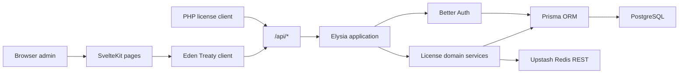
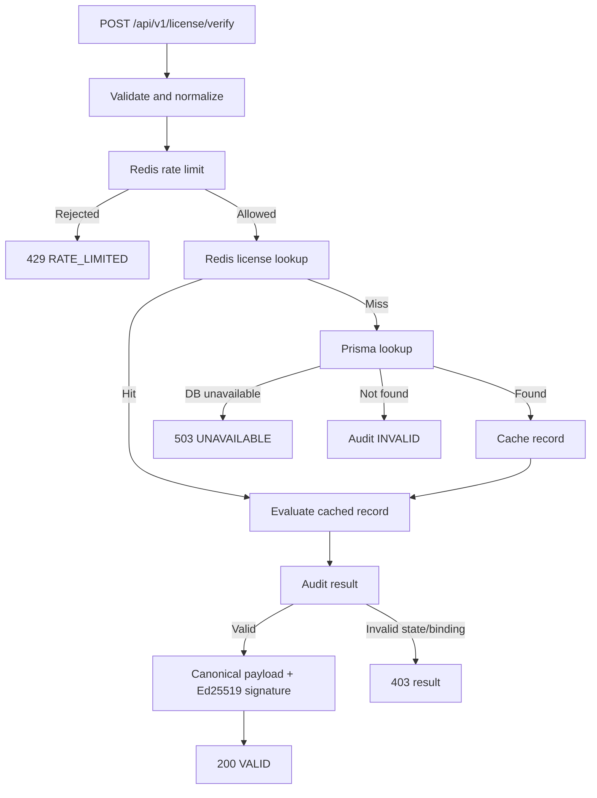

# Technical Design — LEPS SvelteKit + Elysia Rewrite

**Status:** Draft for review  
**Date:** 2026-07-11

## 1. Ringkasan Arsitektur

LEPS tetap menjadi monolit dalam satu repository dan satu deployment Vercel. SvelteKit menangani routing halaman, rendering, session-aware layouts, dan aset frontend. Seluruh endpoint `/api/*` diteruskan ke satu Elysia app melalui catch-all SvelteKit server route.



## 2. Stack

| Area | Pilihan |
|---|---|
| Frontend | Svelte 5 + SvelteKit |
| Backend | Elysia |
| API client | Eden Treaty |
| Authentication | Better Auth |
| ORM | Prisma |
| Database | PostgreSQL |
| Cache/rate limit | Upstash Redis REST |
| Validation | Elysia schema (`t`) pada API boundary |
| Package manager/local runtime | Bun |
| Production runtime | Vercel Node.js |
| Deployment adapter | `@sveltejs/adapter-vercel` |
| Test runner | `bun:test` |
| Browser smoke | Playwright |

Dependency versions harus dipin secara eksplisit dan dikunci melalui `bun.lock`. Nilai `latest` tidak boleh dipakai di `package.json`.

## 3. Runtime dan Deployment Model

### 3.1 Local

- `bun install`
- `bun run dev`
- `bun test`
- PostgreSQL lokal atau remote development database.
- Redis opsional; memory rate-limit fallback hanya diperbolehkan di development.

### 3.2 Production

- SvelteKit dibangun dengan adapter Vercel.
- Production functions memakai Node.js runtime stabil.
- Elysia dijalankan melalui Web Standard `Request`/`Response`; tidak membuka port sendiri.
- Satu domain melayani public web, dashboard, auth, dan API sehingga auth cookie tetap same-origin.
- Bun runtime Vercel tidak menjadi dependency desain dan dapat dievaluasi kembali setelah stabil.

## 4. Struktur Folder Target

```text
src/
├── app.css
├── hooks.server.ts
├── lib/
│   ├── api/
│   │   ├── app.ts
│   │   ├── admin.ts
│   │   ├── auth.ts
│   │   ├── health.ts
│   │   └── verify.ts
│   ├── components/
│   │   ├── ui/
│   │   ├── app-shell/
│   │   └── licenses/
│   ├── server/
│   │   ├── auth.ts
│   │   ├── crypto.ts
│   │   ├── license.ts
│   │   ├── prisma.ts
│   │   └── redis.ts
│   ├── auth-client.ts
│   └── eden.ts
└── routes/
    ├── +layout.svelte
    ├── +page.svelte
    ├── login/+page.svelte
    ├── dashboard/
    │   ├── +layout.server.ts
    │   ├── +layout.svelte
    │   ├── +page.svelte
    │   ├── licenses/+page.svelte
    │   └── audit-logs/+page.svelte
    └── api/[...slugs]/+server.ts
prisma/
├── schema.prisma
├── seed.ts
└── migrations/
tests/
├── api/
├── domain/
└── smoke/
```

Struktur boleh dipadatkan ketika sebuah folder hanya akan berisi satu file. Tidak dibuat repository layer, service interface, factory, atau DTO class tanpa kebutuhan nyata.

## 5. Batas Komponen

### 5.1 SvelteKit

- File-based page routing.
- Public page prerender.
- Login dan dashboard layouts.
- Server-side dashboard session guard.
- Responsive UI dan browser state.
- Memanggil Elysia melalui Eden Treaty atau native `fetch` saat Eden tidak memberi nilai tambahan.

### 5.2 Elysia

- Satu application instance dengan prefix `/api`.
- Runtime validation pada seluruh request boundary.
- Better Auth handler.
- Admin auth guard.
- Public verification API.
- Consistent success/error serialization.
- Tidak berisi markup atau UI behavior.

### 5.3 Domain Functions

- Normalisasi domain dan path.
- Generate license key.
- HMAC Telegram token.
- Evaluate license state dan binding.
- Membentuk canonical signed payload.
- Ed25519 signing.

Domain functions menerima data biasa dan tidak membaca request framework secara langsung.

### 5.4 Prisma

- Satu singleton client per process.
- Semua database query memakai Prisma API.
- Transaction dipakai hanya ketika mutation terdiri dari beberapa write yang harus atomic.
- PostgreSQL tetap source of truth.

### 5.5 Redis

- Cache license record.
- Fixed-window rate limiting untuk public verification.
- Cache invalidation setelah mutation license.
- Tidak menyimpan session atau source-of-truth data.

## 6. Elysia Mount

Catch-all SvelteKit route meneruskan seluruh method ke `app.handle(request)`.

```text
src/routes/api/[...slugs]/+server.ts
└── Elysia({ prefix: "/api" })
```

Elysia app diekspor beserta tipenya agar Eden Treaty dapat melakukan end-to-end inference tanpa code generation.

## 7. Authentication dan Authorization

1. Better Auth memakai Prisma adapter dan email/password.
2. Handler dipasang pada `/api/auth/*` di Elysia.
3. Public signup disabled secara default.
4. Seeder dapat mengaktifkan pembuatan admin melalui proses internal yang eksplisit.
5. `hooks.server.ts` membaca session agar dashboard layout dapat melakukan redirect sebelum render.
6. Admin Elysia plugin memanggil Better Auth session API menggunakan request headers.
7. Setiap endpoint `/api/admin/*` memakai guard yang sama.
8. Tidak ada role abstraction; keberadaan user yang valid berarti administrator.

Page guard adalah UX boundary. Elysia guard adalah security boundary.

## 8. Data Model

### 8.1 Better Auth Tables

`User`, `Session`, `Account`, dan `Verification` mengikuti schema yang dihasilkan Better Auth/Prisma adapter. Field tidak dimodifikasi tanpa kebutuhan produk.

### 8.2 License

| Field | Tipe | Catatan |
|---|---|---|
| `id` | UUID | Primary key |
| `licenseKey` | String unique | Dihasilkan server |
| `allowedDomain` | String | Hostname normalized |
| `allowedPath` | String | Absolute normalized path |
| `telegramBotTokenHash` | String | HMAC-SHA256, token tidak disimpan plaintext |
| `telegramChatId` | String | Exact normalized identifier |
| `status` | Enum | Hanya `ACTIVE`, `SUSPENDED`; `EXPIRED` merupakan status efektif turunan |
| `expiresAt` | DateTime | UTC |
| `createdAt` | DateTime | UTC |
| `updatedAt` | DateTime | UTC |

Status efektif dievaluasi secara deterministik: `SUSPENDED` menang terlebih dahulu, kemudian `EXPIRED` bila `expiresAt <= now`, selain itu `ACTIVE`. Dengan demikian database tidak menyimpan status `EXPIRED` yang dapat drift dari waktu expiry.

### 8.3 VerificationLog

| Field | Tipe | Catatan |
|---|---|---|
| `id` | UUID | Primary key |
| `licenseId` | UUID nullable | Null ketika license tidak ditemukan atau license dihapus |
| `licenseKeyFingerprint` | String | HMAC-SHA256 terpotong untuk korelasi; bukan prefix key plaintext |
| `requestIp` | String | Client IP hasil trusted proxy parsing |
| `requestHost` | String | Normalized hostname |
| `requestPath` | String | Normalized path |
| `statusResult` | String | Result code |
| `createdAt` | DateTime | UTC |

Relasi ke `License` memakai `onDelete: SetNull` agar audit history tetap tersimpan setelah license dihapus. Index minimum: `licenseId`, `statusResult`, `createdAt`, dan `licenseKeyFingerprint`. Index tambahan hanya ditambah berdasarkan query yang benar-benar digunakan.

## 9. Normalisasi Input

### 9.1 Domain

- Trim whitespace.
- Lowercase.
- Tolak scheme, path, query, fragment, dan port.
- Hapus satu trailing dot bila ada.
- Tolak hostname yang tidak valid.
- Perbandingan dilakukan setelah kedua sisi dinormalisasi.

### 9.2 Path

- Trim whitespace.
- Harus dimulai `/`.
- Hilangkan trailing slash kecuali root `/`.
- Tolak query dan fragment.
- Tidak melakukan filesystem lookup.

### 9.3 Telegram Binding

- Bot token diterima hanya pada create, replace, dan verification request.
- Server menghitung HMAC-SHA256 memakai `LICENSE_BINDING_SECRET`.
- Perbandingan hash memakai timing-safe equality.
- Response admin tidak pernah mengembalikan token atau hash.

## 10. License Verification Flow



Audit write bersifat best-effort setelah hasil dapat ditentukan. Kegagalan audit dilog server-side tetapi tidak mengganti response.

## 11. Cryptography

### 11.1 Telegram Token Hash

- Algorithm: HMAC-SHA256.
- Secret: `LICENSE_BINDING_SECRET`.
- Purpose-separated input prefix: `telegram-token:v1:`.
- Output: base64url.

License key fingerprint memakai secret yang sama dengan purpose prefix terpisah `license-key-fingerprint:v1:`. Output dipotong menjadi 16 byte lalu di-encode base64url agar dapat dikorelasikan tanpa menyimpan prefix key plaintext.

### 11.2 License Response Signature

- Algorithm: Ed25519.
- Private key: `LICENSE_SIGNING_PRIVATE_KEY`, PKCS#8 DER yang di-encode base64, server-only.
- Public key: `LICENSE_SIGNING_PUBLIC_KEY`, SPKI DER yang di-encode base64 dan dapat dibagikan ke PHP client.
- Implementasi memakai standard `node:crypto`/Web Crypto, bukan dependency crypto baru.
- Server membentuk compact JSON object dengan stable field order, meng-encode byte UTF-8, mengembalikannya sebagai `signed_payload` base64url, lalu menandatangani byte asli tersebut.
- PHP client memverifikasi signature terhadap hasil decode `signed_payload`, kemudian membaca dan memvalidasi isi payload. Client tidak perlu merekonstruksi serialisasi JSON.

Canonical payload minimum:

```text
version
status
license_key
domain
request_path
expires_at
issued_at
```

`issued_at` mencegah response dianggap timeless. Client harus memverifikasi signature dan menerapkan batas freshness yang didokumentasikan ketika client PHP dibuat.

## 12. Redis Design

### 12.1 Keys

```text
lic:<license_key>
rl:verify:<client_ip>
```

### 12.2 Cache

- TTL default license cache: 5 menit untuk membatasi stale authorization bila invalidation gagal.
- Cache hanya memuat field yang dibutuhkan verification, termasuk Telegram token hash.
- Create/update/suspend/activate/extend/delete selalu menghapus cache key.
- Kegagalan invalidation setelah database mutation menghasilkan error eksplisit dan UI menyediakan retry; database mutation yang sudah committed tidak disamarkan sebagai rollback.
- Manual purge endpoint tetap tersedia.

### 12.3 Rate Limit

- Fixed window: 60 request per 60 detik per IP sebagai default awal.
- Redis `INCR` + `EXPIRE` atau atomic equivalent.
- Development tanpa Redis memakai process-local Map.
- Production tanpa Redis mengembalikan `503`, bukan fallback memory lintas serverless instance yang tidak konsisten.

## 13. API Response Model

Success dan domain result memakai payload endpoint-specific. Error transport memakai bentuk konsisten:

```json
{
  "status": "INVALID",
  "error_code": "ERR_DOMAIN_PATH_MISMATCH",
  "message": "The license binding does not match this installation."
}
```

Validation error menambahkan `issues` yang aman. Stack trace, Prisma error, Redis response, dan environment detail hanya masuk server log.

## 14. Error Policy

| Kondisi | Perilaku |
|---|---|
| Payload invalid | `400 VALIDATION_ERROR` |
| Session admin tidak ada | `401 UNAUTHORIZED` |
| Admin resource tidak ditemukan | `404 NOT_FOUND` |
| License invalid/suspended/expired | `403` dengan domain status |
| Rate limit terlampaui | `429 RATE_LIMITED` |
| Redis cache gagal | Query PostgreSQL |
| Redis rate limiter production gagal | `503 UNAVAILABLE` |
| Database gagal + cache hit | Evaluate cache |
| Database gagal + cache miss | `503 UNAVAILABLE` |
| Audit write gagal | Log error, pertahankan hasil verification |
| Cache invalidation mutation gagal | `503 ERR_CACHE_INVALIDATION_FAILED`, state database tetap menjadi truth, UI menawarkan retry purge |

## 15. Security Controls

- OWASP Top 10:2025 adalah baseline minimum dan bukan klaim sertifikasi formal.
- Runtime validation pada semua input API.
- Same-origin auth cookie.
- Better Auth trusted origins dibatasi ke local dan production URL.
- Public signup disabled.
- Password admin minimum 12 karakter dan seed menolak password yang lebih lemah.
- CSRF protection mengikuti Better Auth dan same-origin mutation rules.
- API verification ditujukan untuk PHP server-to-server client sehingga tidak mengaktifkan CORS browser tanpa kebutuhan baru yang eksplisit.
- Security headers dikonfigurasi di SvelteKit hook/adapter response.
- Telegram secret di-hash dengan keyed HMAC.
- Ed25519 private key tidak pernah dikirim atau dicatat.
- Sensitive values disensor dari logs.
- Destructive UI action membutuhkan confirmation.
- Server tetap melakukan authorization dan tidak mempercayai disabled UI controls.

### 15.1 OWASP Top 10:2025 Mapping

| Kategori | Kontrol LEPS | Evidence minimum sebelum release |
|---|---|---|
| **A01 Broken Access Control** | Deny-by-default pada `/api/admin/*`, session guard terpusat, object lookup scoped dan tidak mempercayai ID dari UI | Test seluruh admin endpoint tanpa session; test akses object tidak ada/invalid; tidak ada admin mutation public |
| **A02 Security Misconfiguration** | Startup validation, trusted origins terbatas, secure cookie production, security headers, no stack trace, no debug route production | Review environment preview/production, header check, error-response check, missing-secret startup test |
| **A03 Software Supply Chain Failures** | Exact dependency versions, committed `bun.lock`, dependency audit, dependency minimum, review migration/build scripts | Lockfile diff reviewed, dependency vulnerability audit tercatat, tidak ada dependency `latest` |
| **A04 Cryptographic Failures** | Better Auth password handling, HMAC-SHA256 token binding, Ed25519 response signing, server-only private key, purpose-separated inputs | Sign/verify test, wrong-key test, token plaintext scan, secret redaction check |
| **A05 Injection** | Elysia schema validation, Prisma parameterized queries, raw query hanya static, Svelte escaping, tanpa unsafe HTML | Malformed payload tests, search/filter injection strings, code scan untuk raw SQL dan unsafe HTML |
| **A06 Insecure Design** | Rate limit, cache TTL/invalidation policy, fail-safe auth, explicit trust boundaries, derived expiry state, no shared signing secret in client | Threat/abuse case review dan tests untuk replay freshness, cache failure, DB failure, serta invalidation failure |
| **A07 Authentication Failures** | Better Auth, signup disabled, password minimum 12, safe login error, secure session cookie, auth rate limiting | Invalid-login tests, account-enumeration check, expired-session test, brute-force/rate-limit check |
| **A08 Software or Data Integrity Failures** | Lockfile integrity, reviewed migrations, Ed25519 signed authorization payload, controlled deployment pipeline, no runtime plugin loading | Fresh migration/build evidence, signature tamper test, deployment artifact berasal dari reviewed commit |
| **A09 Security Logging and Alerting Failures** | Request ID, structured safe logs, auth/rate-limit/5xx events, no secret logging, production monitoring threshold | Log redaction test, sample security events terlihat di Vercel logs, alert/monitor destination dan threshold terdokumentasi |
| **A10 Mishandling of Exceptional Conditions** | Central error handler, deterministic error model, timeouts, explicit Redis/PostgreSQL failure policy, no swallowed security failure | Tests untuk malformed input, timeout, Redis down, DB down, audit failure, cache purge failure, dan startup failure |

Setiap implementation batch harus menyebut kategori OWASP yang disentuh dan meninggalkan verification evidence. Batch global verification meninjau seluruh matriks serta mencatat status `PASS`, `FAIL`, atau `NOT APPLICABLE` dengan alasan.

## 16. Observability

- Structured console logs dengan event name, request ID, route, result, dan safe error summary.
- Request ID dikembalikan pada error response untuk korelasi.
- Health endpoint memeriksa konfigurasi wajib dan koneksi PostgreSQL; detail secret tidak ditampilkan.
- Tidak menambah vendor observability sampai log Vercel terbukti tidak cukup.

## 17. Environment Variables

```text
DATABASE_URL
BETTER_AUTH_SECRET
BETTER_AUTH_URL
ADMIN_EMAIL
ADMIN_NAME
ADMIN_PASSWORD
LICENSE_BINDING_SECRET
LICENSE_SIGNING_PRIVATE_KEY
LICENSE_SIGNING_PUBLIC_KEY
KV_REST_API_URL or UPSTASH_REDIS_REST_URL
KV_REST_API_TOKEN or UPSTASH_REDIS_REST_TOKEN
```

Startup production harus gagal jelas bila database, auth secret, crypto keys, atau Redis rate-limit configuration tidak lengkap.

## 18. Testing Strategy

### Unit

- Input normalization.
- License key generation format.
- Expiry/status/binding evaluation.
- Telegram token HMAC and timing-safe comparison.
- Canonical payload generation.
- Ed25519 sign/verify roundtrip.

### Integration

- Elysia `app.handle()` untuk auth guard, admin CRUD, rate limit, verification, dan error response.
- Prisma test database dari migration kosong.
- Redis adapter diuji melalui contract-level mocks atau test instance tanpa membuat wrapper berlapis.

### Browser Smoke

- Login dan unauthorized redirect.
- Create, edit, suspend/activate, extend, purge, dan delete license.
- Search/filter/pagination.
- Audit logs.
- Logout.
- 360, 768, 1024, dan 1440 px.

### Release Verification

- `bun test`
- lint/typecheck
- production build
- migration deploy dari database kosong
- seed admin
- Vercel preview smoke
- security dan accessibility review

## 19. Architecture Decisions

1. **SvelteKit router, bukan TanStack Router:** dukungan native dan tidak menambah router kedua.
2. **Prisma dipertahankan:** mengurangi jumlah perubahan dalam rewrite.
3. **Elysia di dalam SvelteKit route:** monolit satu deployment dengan API boundary jelas.
4. **Eden tanpa TanStack Query:** kebutuhan data saat ini dapat ditangani oleh page load/fetch dan explicit refresh.
5. **Node production, Bun local:** production stabil tanpa mengikat desain pada Bun runtime Vercel beta.
6. **Ed25519, bukan HMAC response signature:** client membawa public key tanpa membocorkan signing secret.
7. **Tidak ada repository/service interfaces spekulatif:** business functions sederhana sudah cukup.

## 20. Referensi Resmi

- [Elysia integration with SvelteKit](https://elysiajs.com/integrations/sveltekit)
- [Elysia Eden Treaty](https://elysiajs.com/eden/overview)
- [Better Auth SvelteKit integration](https://better-auth.com/docs/integrations/svelte-kit)
- [Better Auth Elysia handler](https://better-auth.com/docs/installation)
- [Vercel Bun runtime status](https://vercel.com/docs/functions/runtimes/bun)
- [Node.js Web Crypto Ed25519](https://nodejs.org/api/webcrypto.html)
- [OWASP Top 10:2025](https://owasp.org/Top10/2025/)
