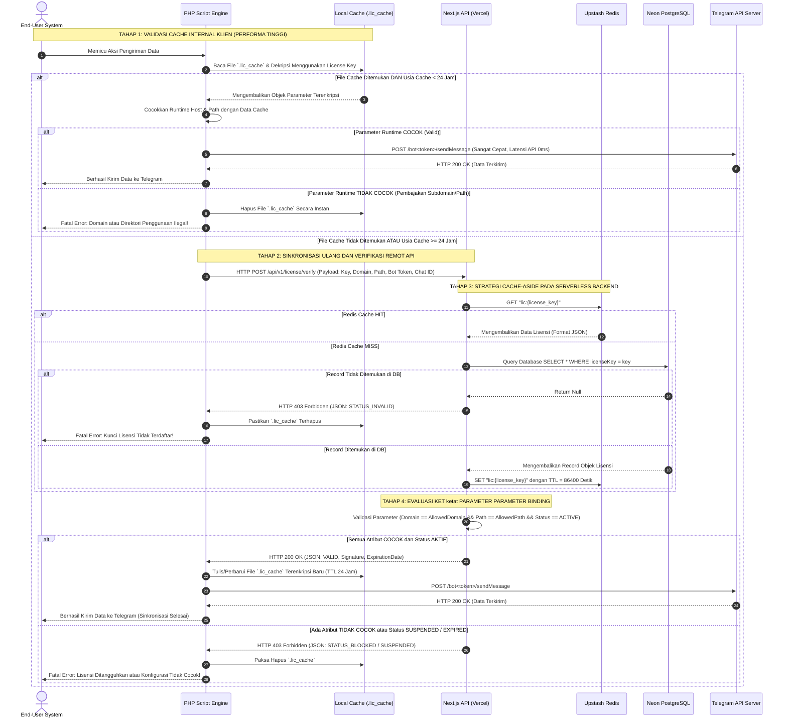

# PROJECT REQUIREMENT DOCUMENT (PRD)

**Project Name:** Licensing Engine for PHP Script (LEPS)
**Version:** 1.1.0 (Optimized for Agentic AI Codex)
**Target Stack:** Next.js (App Router), Upstash Redis, Neon PostgreSQL, Prisma ORM, Vercel Deployment

---

## 1. Overview Project

### 1.1 Context & Problem Statement

Sistem ini dirancang untuk mengamankan dan mengelola siklus hidup distribusi script PHP proprietary. Masalah utama yang diselesaikan adalah penyalahgunaan redistribusi tanpa izin, kloning antar domain, penggunaan lintas subdomain/subfolder secara ilegal, serta latensi performa tinggi yang sering disebabkan oleh pembatasan API pihak ketiga secara berulang pada proses kritis.

### 1.2 System Goals

Membangun platform manajemen lisensi terpusat (Admin Panel) berbasis Next.js yang dideploy ke Vercel Serverless Network. Mengoptimalkan verifikasi lisensi jarak jauh di bawah 50ms menggunakan pola arsitektur **Cache-Aside via Upstash Redis REST API**, serta membatasi konsumsi resource API melalui mekanisme **Hybrid Local Caching** di sisi client PHP (hanya melakukan sinkronisasi penuh sekali dalam 24 jam).

---

## 2. Requirements

### 2.1 Functional Requirements (FR)

- **FR-01: Admin Authentication & Security**
  - Sistem hanya memiliki satu akun Super Admin (Single Tenant).
  - Akses wajib diamankan menggunakan JWT berbasis HTTP-Only Cookie / Iron Session.
- **FR-02: Cryptographic License Token Generation**
  - Lisensi di-generate secara otomatis dalam format string kriptografis acak berkekuatan tinggi (KSUID/UUIDv4 prefiks `lic_`).
- **FR-03: Ultra-Strict Parameter Binding**
  - Lisensi wajib terikat secara mutlak pada kombinasi parameter berikut:
    1. **1 Absolute Domain Host** (Contoh: `targetdomain.com`. Penggunaan di `otherdomain.com` otomatis ditolak).
    2. **1 Specific Script Path/Subfolder** (Contoh: `/app/cron`. Jika dipindahkan ke `/backup/cron` atau direktori lain, eksekusi diblokir).
    3. **1 Telegram Bot Token** (Strictly bound to the specific bot instance).
    4. **1 Telegram User/Chat ID** (Strictly bound to the target recipient channel/user).
- **FR-04: License Lifecycle Control**
  - Masa berlaku default adalah 14 hari (2 minggu) sejak waktu generate.
  - Admin dapat memperpanjang masa aktif (`expiresAt`), menonaktifkan (`SUSPENDED`), atau mengaktifkan kembali (`ACTIVE`) lisensi secara manual melalui UI tanpa mengubah kunci lisensi klien.
- **FR-05: Real-time Cache Purging**
  - Setiap kali status lisensi diperbarui oleh Admin di Dashboard, cache terkait pada Redis harus dibersihkan secara atomik (_immediate cache invalidation_).

### 2.2 Non-Functional Requirements (NFR)

- **NFR-01: Latency & Response Time**
  - API endpoints verifikasi (`/api/v1/license/verify`) wajib merespons < 50ms saat status cache _Hit_ pada Edge network.
- **NFR-02: Availability & Resilience**
  - Menggunakan arsitektur Serverless Vercel. Jika database PostgreSQL primer mengalami downtime atau _cold-start_, API harus tetap melayani verifikasi lisensi secara normal dengan memanfaatkan data persisten di Redis (Graceful Degradation Mode).
- **NFR-03: Security Standard Compliant**
  - Proteksi penuh terhadap OWASP Top 10 (khususnya SQL Injection, Broken Access Control, Server-Side Request Forgery, dan Rate Limiting).

---

## 3. Core Features

### 3.1 Admin Dashboard (Next.js Front-End)

- **Analytics Metric Cards:** Menampilkan total lisensi aktif, total pembajakan terdeteksi (failed attempts), serta beban hit rate Redis (Hit vs Miss ratio).
- **Data Table License Management:** CRUD Lisensi lengkap dengan filter pencarian real-time berdasarkan Domain atau Telegram Chat ID. Menggunakan komponen `@tanstack/react-table`.
- **Manual Control Center:** Toggle interaktif untuk mengubah status lisensi secara instan (`ACTIVE` / `SUSPENDED`) dan tombol cepat untuk "+14 Hari Perpanjangan".

### 3.2 Licensing Verification Engine (Next.js API Route)

- **Endpoint:** `/api/v1/license/verify` (Metode: POST).
- **Zod Schema Validation:** Memvalidasi struktur payload request secara ketat sebelum mengeksekusi logika bisnis.
- **Cache-Aside Architecture Logic:**
  1. Cek kunci data pada Redis: `lic:{license_key}`.
  2. Jika _Hit_ (ada di cache): langsung evaluasi parameter domain, path, bot token, dan chat ID.
  3. Jika _Miss_ (tidak ada di cache): query ke Neon PostgreSQL, simpan hasilnya ke Redis dengan TTL 86400 detik (24 jam), kemudian lakukan evaluasi.

### 3.3 Client-Side Logic Engine (PHP Script Integration)

- **Hybrid Local-Cache Mechanism:** Untuk mengeliminasi hambatan kecepatan pengiriman data ke Telegram, script PHP tidak diperbolehkan melakukan _remote cURL API request_ pada setiap transaksi data.
- **Execution Flow:**
  - Script membaca file cache lokal (`.lic_cache`) yang disimpan dalam format JSON terenkripsi AES-256-CBC menggunakan _License Key_ sebagai salt komponen kunci enkripsi.
  - Jika file berumur < 24 jam, script langsung mengekstrak parameter lokal, mencocokkannya dengan runtime environment (`$_SERVER['HTTP_HOST']` dan `$_SERVER['SCRIPT_NAME']`), lalu mengeksekusi pengiriman Telegram.
  - Jika file > 24 jam atau tidak ditemukan, script melakukan _remote API call_ untuk menyegarkan file `.lic_cache` lokal.

---

## 4. Roles & Permissions

Sistem mengadopsi kontrol akses berbasis peran tunggal yang terisolasi secara ketat:

| Role Name            | Access Target                  | Allowed Operations                                      | Auth Mechanism                 |
| :------------------- | :----------------------------- | :------------------------------------------------------ | :----------------------------- |
| **Super Admin**      | `/dashboard/*`, `/api/admin/*` | `CREATE`, `READ`, `UPDATE`, `DELETE`, `CACHE_PURGE`     | JWT / HTTP-Only Session Cookie |
| **Anonymous/Client** | `/api/v1/license/verify`       | `READ / VERIFY` (Hanya eksekusi logika pencocokan data) | Rate-Limited Public REST API   |

---

## 5. UI/UX Specification

- **Design Token / Theme:** Dark Mode Modern (Slate-900 sebagai background utama, Emerald-500 sebagai indikator aktif, Rose-500 sebagai indikator tersuspensi/error).
- **UI Components:** Menggunakan `shadcn/ui` berbasis Tailwind CSS dan Radix UI primitif.
- **Page Layout Trees:**
  - `/login`: Form terpusat dengan proteksi CSRF token bawaan Next.js Server Actions dan pembatasan input.
  - `/dashboard`: Layout dengan Sidebar persisten, memuat navigasi ke Overview, Lisensi, dan Audit Logs.
  - `/dashboard/licenses`: Memanfaatkan Skeleton loading state sewaktu proses fetching data dari database serverless.

---

## 6. System Architecture

Arsitektur aplikasi terdistribusi secara serverless dan edge-optimized:

```
+--------------------------------------------------------------------------+
|                            PHP Client Script                             |
+--------------------------------------------------------------------------+
                                     |
                                     | (1x per 24 Jam atau jika Cache Expired)
                                     v
+--------------------------------------------------------------------------+
|                     Vercel Edge & Serverless Gateway                     |
|  - Rate Limiting Middleware                                              |
|  - CORS & Security Header Enforcement                                    |
+--------------------------------------------------------------------------+
                                     |
                                     v
+--------------------------------------------------------------------------+
|                Next.js Route Endpoint: /api/v1/verify                    |
+--------------------------------------------------------------------------+
                     |                                |
        (1) Cek Cache|                  (2) Cache Miss|
                     v                                v
+--------------------------+             +--------------------------+
|    Upstash Redis Cloud   |             |     Neon PostgreSQL      |
|  (REST API Serverless)   |             |   (Serverless Database)  |
+--------------------------+             +--------------------------+
                     |                                |
                     | [Return Cache Data]            | [Query & Write Cache]
                     +----------------+---------------+
                                      |
                                      v
                        [Evaluasi Parameter Atribut]
                                      |
                                      v
                        [Kirim Response JSON Terpilih]
```

---

## 7. Sequence Diagram (Refined & Highly Formatted)

Diagram urutan berikut menguraikan siklus hidup eksekusi penuh dari inisiasi script PHP hingga validasi berlapis pada arsitektur Next.js & Redis Engine:



---

## 8. Database Schema / ERD (Prisma Data Model)

```prisma
datasource db {
  provider = "postgresql"
  url      = env("DATABASE_URL")
}

generator client {
  provider = "prisma-client-js"
}

enum LicenseStatus {
  ACTIVE
  SUSPENDED
  EXPIRED
}

// Admin authentication uses Better Auth tables:
// user, session, account, and verification.

model License {
  id                 String           @id @default(uuid())
  licenseKey         String           @unique
  allowedDomain      String           // Format strict: "clientdomain.com"
  allowedPath        String           // Format strict: "/subfolder" atau "/" untuk root
  telegramBotToken   String
  telegramChatId     String
  status             LicenseStatus    @default(ACTIVE)
  expiresAt          DateTime         // Masa aktif 14 hari semenjak generate/extend
  createdAt          DateTime         @default(now())
  updatedAt          DateTime         @updatedAt
  logs               VerificationLog[]

  @@index([licenseKey])
  @@index([allowedDomain])
  @@index([status])
}

model VerificationLog {
  id           String   @id @default(uuid())
  licenseId    String
  license      License  @relation(fields: [licenseId], references: [id], onDelete: Cascade)
  requestIp    String
  requestHost  String   // Melacak domain asal request cURL klien
  requestPath  String   // Melacak subfolder asal request cURL klien
  statusResult String   // Nilai: "SUCCESS", "MISMATCH_DOMAIN", "MISMATCH_PATH", "MISMATCH_TELEGRAM", "SUSPENDED", "EXPIRED"
  createdAt    DateTime @default(now())

  @@index([licenseId])
}
```

---

## 9. API Specification

### 9.1 Core Verification Route

- **Endpoint:** `POST /api/v1/license/verify`
- **Content-Type:** `application/json`

#### Request Body Schema (Validated via Zod)

```json
{
  "license_key": "lic_9f83b27c51a04e3ab11c33f2",
  "domain": "myclientwebsite.com",
  "request_path": "/modules/telegram_bot",
  "telegram_bot_token": "718293812:AAH38xJkl921zP_wM192skdW",
  "telegram_chat_id": "88291029"
}
```

#### Response Payloads

##### Case 1: Verification Success (200 OK)

```json
{
  "status": "VALID",
  "message": "Authorization granted.",
  "expires_at": "2026-05-31T23:59:59.000Z",
  "signature": "e3b0c44298fc1c149afbf4c8996fb92427ae41e4649b934ca495991b7852b855"
}
```

##### Case 2: Validation Failed Due to Mismatch (403 Forbidden)

```json
{
  "status": "INVALID",
  "error_code": "ERR_DOMAIN_PATH_MISMATCH",
  "message": "The license configuration is locked to another absolute domain/subfolder structure."
}
```

##### Case 3: License Suspended by Admin (403 Forbidden)

```json
{
  "status": "SUSPENDED",
  "error_code": "ERR_LICENSE_REVOKED",
  "message": "This license key has been manually suspended due to terms violation."
}
```

---

## 10. Tech Stack

- **Meta-Framework:** Next.js 14/15 (App Router, Server Actions Core)
- **Programming Language:** TypeScript (Strict Mode Enabled)
- **Database Architecture:** Neon Serverless PostgreSQL (Edge compatible layer)
- **In-Memory Caching Engine:** Upstash Redis (REST Interface for connection pool avoidance)
- **ORM Component:** Prisma ORM Client
- **Validation Pipeline:** Zod Runtime Validation
- **Cryptographic Tools:** Node.js Native Web Crypto API (SHA-256 Signature verification)

---

## 11. Deployment & Security Hardening (OWASP Top 10)

### 11.1 Vercel Deployment Architecture

- Seluruh endpoint krusial diletakkan pada arsitektur Vercel Serverless Functions.
- Environment variables dilindungi penuh menggunakan Vercel Vault System.

### 11.2 OWASP Top 10 Mitigation Plan

1. **A01:2021-Broken Access Control:** Implementasi Middleware Next.js pada rute `/dashboard/:path*`. Sesi token wajib divalidasi langsung di layer terdepan sebelum merender markup UI.
2. **A03:2021-Injection:** Pencegahan SQL Injection dijamin secara mutlak melalui penggunaan Prisma Object Relational Mapping yang mengonversi seluruh parameter masukan menjadi SQL parameterized queries secara otomatis.
3. **A04:2021-Insecure Design (Anti-Bypass Validation):** Di sisi client PHP, data dari server dicocokkan kembali secara silang terhadap variabel global `$_SERVER['HTTP_HOST']` dan `dirname($_SERVER['SCRIPT_NAME'])` demi mendeteksi spoofing domain jarak jauh.
4. **A05:2021-Security Misconfiguration:** Menetapkan Header Security HTTP yang ketat melalui `next.config.js` (`X-Frame-Options: DENY`, `X-Content-Type-Options: nosniff`, `Content-Security-Policy`).
5. **Rate Limiting:** Menggunakan middleware Upstash Rate Limiting di rute API publik untuk membatasi maksimal 60 request per menit per alamat IP guna meredam serangan Denial of Service (DoS).

---

## 12. Future Enhancements

- **Dynamic Variable Obfuscation:** Membangun pipeline internal di admin panel untuk mengunduh versi script PHP yang otomatis di-obfuscate dengan enkripsi tingkat tinggi (Zend Guard / PHP-WeirDo style) setiap kali lisensi baru diterbitkan.
- **Intrusion Detection Telemetry:** Mengirimkan log peringatan instan ke Bot Telegram Admin pribadi apabila ditemukan usaha eksekusi berulang (>5 kali) dari alamat IP atau domain host yang salah secara berurutan.

---
